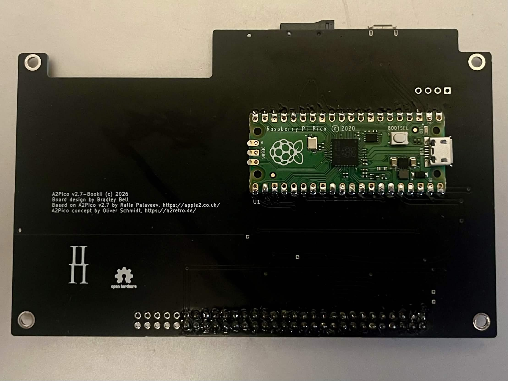

# A2Pico for Book II

A2Pico Version 2.7.BookII is derived from the A2Pico version 2.7, made to fit in the internal slot 7 of the [Book II](https://8086cpu.com/Z80/6502/110.html) from 8086cpu.com. It omits the slide switch and power LED from v2.7.

## Todo

* Replace USB micro-B connector with type C.

* Fabricate a new rear panel with openings for the micro SD card and USB port.

## RPI Usage

| GPIO    | Usage     |
|:--------|:----------|
| 0       |  UART Tx  |
| 1       |  UART Rx  |
| 2       |  ENBL     |
| 3 - 10  | AD0 - AD7 |
| 11 - 14 | A8 - A11  |
| 15      | R/W       |
| 16      | Ф1        |
| 17      | RES       |
| 18      | IRQ       |
| 19      | CMD       |
| 20      | DAT0      |
| 21      | DAT3      |
| 22      | CLK       |
| 26      | AL-OE     |
| 27      | D-OE      |
| 28      | DDIR      |
